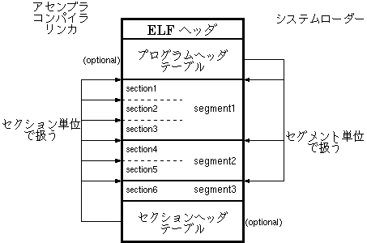

# ELFファイルの構成
ELF ファイルフォーマットを使っている実行可能ファイルはELFヘッダを持ちます。そして、プログラムヘッダテーブルか、セクションヘッダテーブル、あるいはその両方が続きます。

システムローダはプログラムヘッダテーブに記述されたセグメント集合として扱い、コンパイラ・アセンブラ・リンカはセクションヘッダテーブルがに記述された論理セクション集合としてELFを扱います。

# ELFファイルのロード
プログラムヘッダ内にその部分をロードすべきvirtual addrが書いてあるので、それに従ってセグメント単位でプログラムをロードする